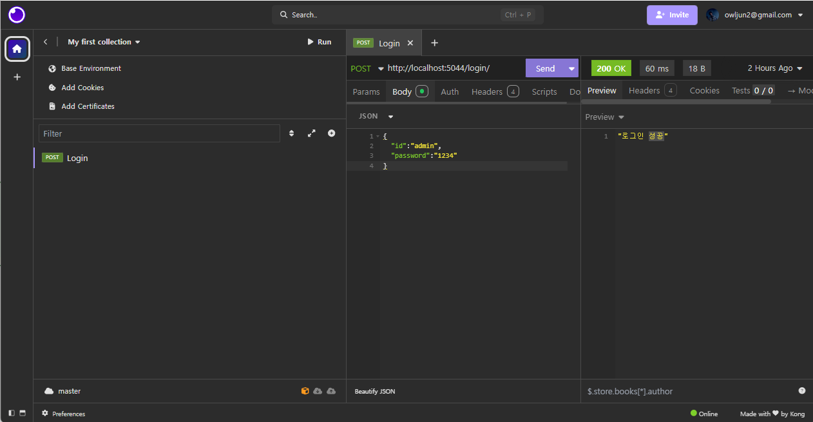
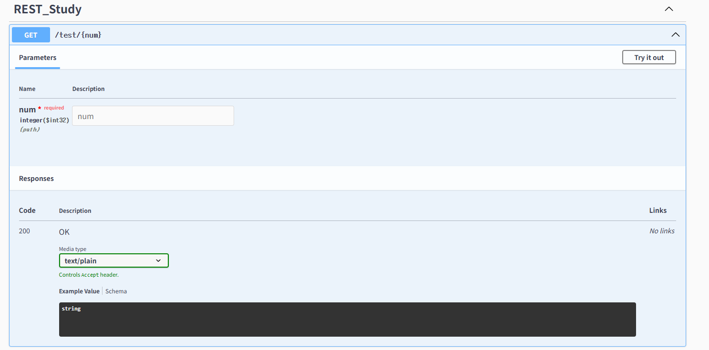

# REST_API_Server
ASP.NET Core 활용 REST API 서버 도전기


## API 테스트 (Insomnia) [URL](https://insomnia.rest/)



## Swagger


> Nuget Package
> **Swashbuckle.AspNetCore 설치**
```CS
var builder = WebApplication.CreateBuilder(args);
builder.Services.AddEndpointsApiExplorer();
builder.Services.AddSwaggerGen();

var app = builder.Build();

app.UseSwagger();
app.UseSwaggerUI();

// WRITE METHODS ...
// .
// .
// .

app.Run();
```

- 자동 문서화

